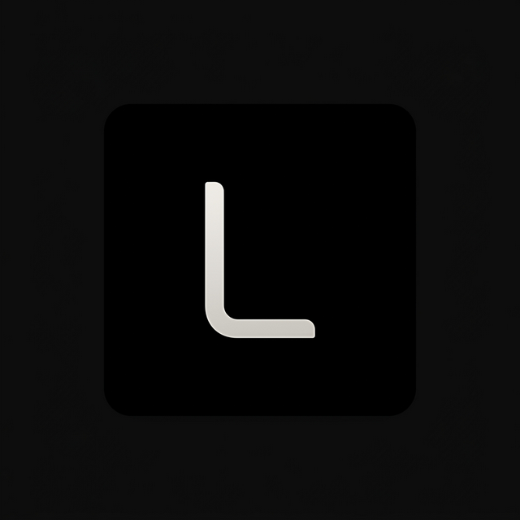
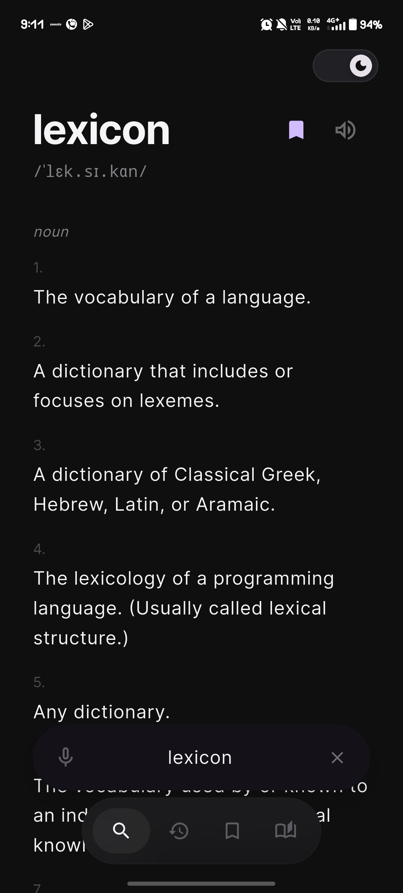
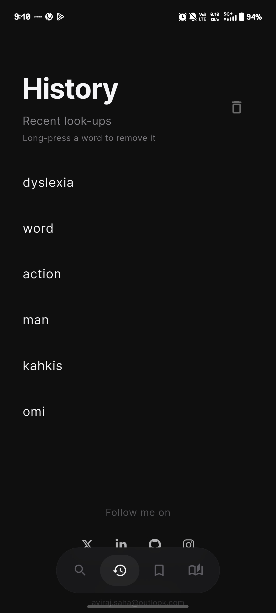
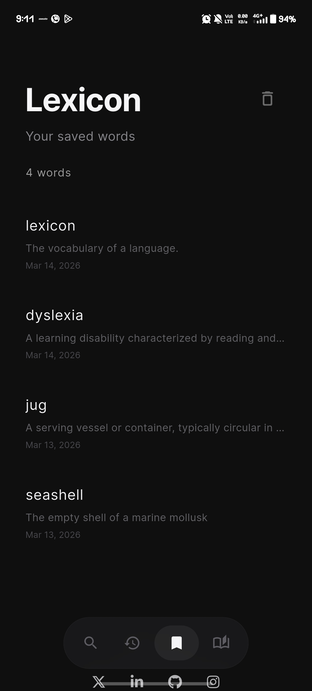
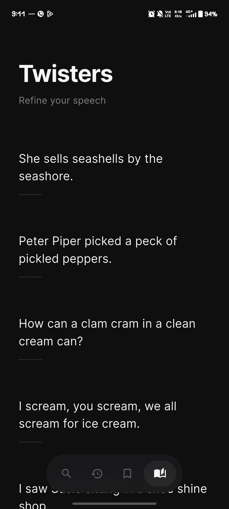
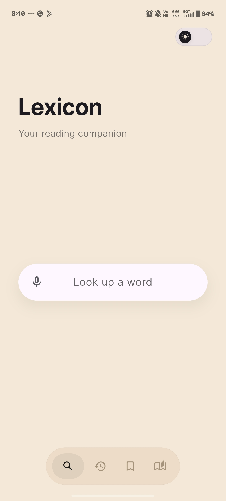

<h1>
  
  Lexicon
</h1>

<p>
  
  
  
  
  
</p>

Lexicon is a small tool I built because I kept running into the same problem while reading.

You see a word you don’t know.  
You search it on Google.  
Suddenly you’re looking at ads, articles, links, and ten other things you didn’t intend to open.

By the time you return to your book, the moment is gone.

Lexicon fixes that.

It gives you the meaning of a word instantly, shows a few related words if you want them, and then lets you get back to reading.

Nothing extra. Nothing distracting.

---

## A Quick Look

Using Lexicon is meant to feel simple.

1. You are reading and come across a word.
2. Open Lexicon and type the word.
3. See the meaning instantly.
4. Go back to your reading.

That’s it.

No ads.  
No clutter.  
No rabbit holes.

---

## Why I Built This

I wanted a dictionary that **stays out of the way**.

Most tools try to give you everything at once — definitions, articles, translations, links, news, videos.  
Sometimes you just want to understand a word and move on.

Lexicon focuses on that one moment.

---

## What You Can Do With Lexicon

**Look up words instantly**

Type a word and see clear meanings and synonyms in a simple layout.

**Explore only if you want to**

If you're curious, you can open the word on Google for deeper context.

**Keep track of words you discover**

Lexicon quietly keeps a record of your lookups so you can revisit them later.

**Stay focused while reading**

The interface is calm and minimal so the app never competes with your book.

**Practice articulation**

There is also a small collection of fifty tongue twisters for anyone who enjoys sharpening their speech.

**Read comfortably**

Lexicon includes both a deep dark theme and a warm, paper-like light theme designed for long reading sessions.

---

## Screenshots

<p align="center">


</p>

<p align="center">


</p>

<p align="center">


</p>

---

## Try Lexicon

The easiest way to install Lexicon is from the **Releases** page.

1. Open the **Releases** section of this repository  or [click here](https://github.com/avirajsa/lexicon_app/releases/)
2. Download the latest **APK**  
3. Open it on your Android device  
4. Install the app

It’s lightweight and ready to use immediately.

---

## Running From Source (Optional)

If you want to run or modify the app yourself:

Clone the repository

```

git clone https://github.com/avirajsa/lexicon_app.git](https://github.com/avirajsa/lexicon_app.git

```

Install dependencies

```

flutter pub get

```

Run the application

```

flutter run

```

---

## Philosophy

Lexicon follows a simple principle.

A dictionary should help you understand a word quickly  
and then disappear.

Words should stay the focus — not the interface.

---

## License

This project is licensed under the MIT License.  
See the LICENSE file for details.

Copyright (c) 2026 Aviraj Saha

