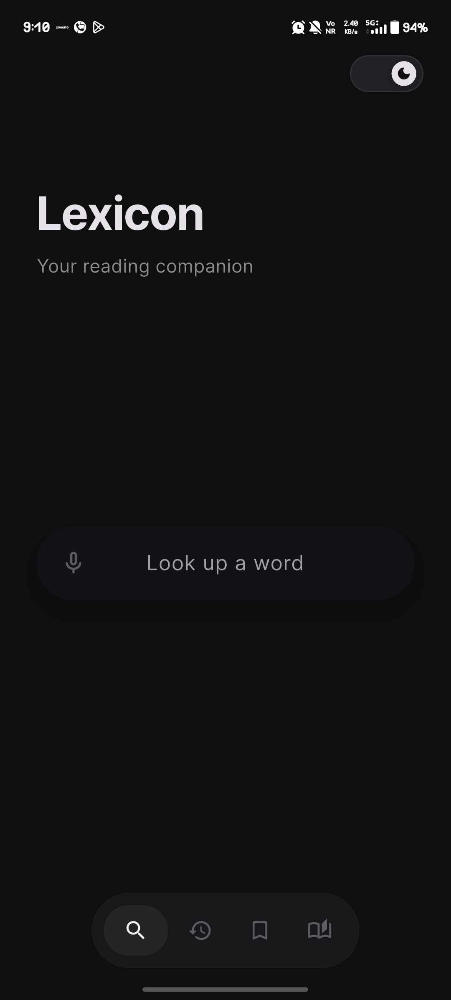

# Lexicon

Lexicon is a minimal, distraction-free dictionary and vocabulary companion designed for readers who want instant word understanding without clutter. 

The app focuses on typography, calm design, and smooth interactions.

---

## Features

• **Instant word lookup**: Quick and intuitive dictionary search.
• **Multiple meanings and synonyms**: Explore the depth of words with clear definitions and synonyms.
• **Google deep-link**: Extended exploration available for every word.
• **Search history**: Automatically tracks your lookups with long-press deletion for easy management.
• **Personal lexicon tracker**: Save words to your own personal collection.
• **50 curated tongue twisters**: A fun way to refine your speech and vocabulary.
• **Reader-focused themes**: Includes a dark theme and a warm paper light theme.
• **Swipe navigation**: Fluid horizontal swipes between tabs for modern interaction.
• **Smooth animations**: Premium animations throughout the app for a refined feel.
• **No-internet detection**: Visual indicators and graceful handling of connectivity issues.

---

## Screenshots

### Lookup Screen


### Search History


### Lexicon Tracker


### Tongue Twisters


### Dark Theme


### Light Theme


---

## Installation

### Clone the repository
```bash
git clone <repository-url>
```

### Install dependencies
```bash
flutter pub get
```

### Run the app
```bash
flutter run
```

---

## Release Support

### Build Release APK
```bash
flutter build apk --release
```

**APK output:** `build/app/outputs/flutter-apk/app-release.apk`

---

## Technology Stack

• **Framework**: Flutter
• **Language**: Dart
• **Networking**: HTTP APIs
• **Storage**: SharedPreferences
• **Design**: Material Design

---

## Design Philosophy

Lexicon is designed for **readers**. 

The interface prioritizes:
• minimal visual noise
• calm typography
• fluid interactions
• fast word understanding

---

## License

This project is licensed under the MIT License - see the [LICENSE](LICENSE) file for details.

Copyright (c) 2026 Aviraj Saha
